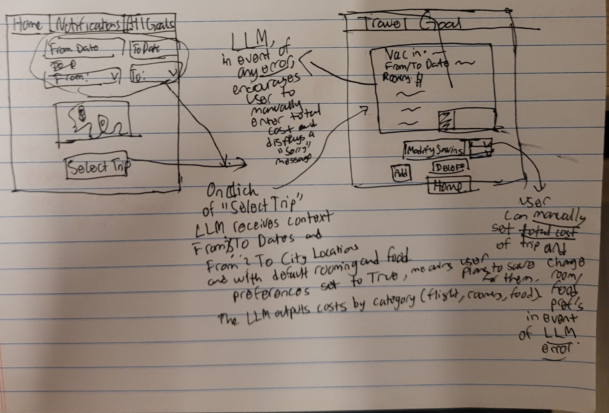

# Original Concept
### concept TripCostEstimation [User]
* **purpose** generate realistic cost estimates based on trip details
* **principle** based on a user's choice of initial dpearture city and arrival city, and the user's sheltering accommodations and food location preferences, an estimate is provided
* that reflects the aforementioned
* **state**
    * a set of Users with
      * a set of **TravelPlans**
    * a set of Locations with
       * a String city
    * a set of **TravelPlans** with
        * a `fromCity` **Location**
        * a `toCity` **Location**
        * a `fromDate` **Date**
        * a `toDate` **Date**
        * a `necessity' **Necessity**
    * a set of **Necessities** with
        * an `accommodation` **Bolean**
        * a `diningFlag` **Boolean**
* **actions**
    *  createTravelPlan(user: User, fromCity: Location, toCity: Location, fromDate: Date, toDate: Date): (travelPlan: TravelPlan)
         * **requires** fromCity and toCity exists and toDate >= fromDate and both are greater than the current date 
         * **effect** create and return a travelPlan with a fromCity, toCity, and from and to dates, and a default necessity (accommodation = True indicating planning to save for rooming costs, diningFlag = True indicating planning to save for food costs))
    * deleteTravelPlan(user: User, travelPlan: TravelPlan)
         * **requires** travelPlan exists and belongs to user
         * **effect** delete the travelPlan
    *  updateNecessity(user: User, travelPlan: TravelPlan, accommodation: Boolean, diningFlag: Boolean): (travelPlan: TravelPlan, necessity: Necessity)
         * **requires** travelPlan exists and belongs to user, accommodation exists as one of the livingSpaces and diningFlag indicates whether the user eats out most of the time (1) or eats homecooked meals (0)
         * **effect** create and add the necessity with accommodation and diningFlag to travelPlan
    * resetNecessity(user: User, travelPlan: TravelPlan)
         * **requires** travelPlan exists and belongs to user
         * **effect** reset the necessity belonging to travelPlan to the default as described in the action createTravelPlan
    * `estimateCost (user: User, travelPlan: TravelPlan): (totalCost: Number)`
         * **requires** travelPlan exists and belongs to user
         * **effect** based on the departure, arrival dates, necessities and departure and arrival locations, gives an estimated cost of the plan, totalCost
# AI-Augmented Concept
<concept_spec>
concept TripCostEstimation

purpose
generate realistic cost estimates based on trip details, using AI for data retrieval and calculation

principle
based on a user's choice of initial departure city and arrival city, and the user's sheltering accommodations and food location preferences, an estimate is provided; the LLM is used to search for and calculate median cost ranges based on the provided necessities.

state
* a set of Users with
   * a set of TravelPlans
* a set of Locations with
   * a city String
* a set of TravelPlans with
   * a fromCity Location
   * a toCity Location
   * a fromDate Date
   * a toDate Date
   * a necessity Necessity
* a set of Necessities with
   * an accommodation Boolean // true for saving for rooms, false for not
   * a diningFlag Boolean // true for saving for eating out, false for not
* a set of CostEstimates with
   * a travelPlanID String
   * a flight Number // estimated total round-trip flight cost in USD
   * a roomsPerNight Number // estimated cost per night in USD
   * a foodDaily Number // estimated cost per day in USD
   * a lastUpdated Date // tracking when the estimate was generated

actions
* createTravelPlan(user: User, fromCity: Location, toCity: Location, fromDate: Date, toDate: Date): (travelPlan: TravelPlan)
   * **requires** fromCity and toCity exists and toDate >= fromDate and both are greater than the current date
   * **effect** create and return a travelPlan with a fromCity, toCity, and from and to dates, and a default necessity (accommodation = true, diningFlag = true)

* deleteTravelPlan(user: User, travelPlan: TravelPlan)
    * **requires** travelPlan exists and belongs to user
    * **effect** delete the travelPlan and any associated CostEstimates

* updateNecessity(user: User, travelPlan: TravelPlan, accommodation: Boolean, diningFlag: Boolean): (travelPlan: TravelPlan, necessity: Necessity)
    * **requires** travelPlan exists and belongs to user, accommodation exists as one of the livingSpaces and diningFlag indicates whether the user plans to save for eating out (true) or not (false)
    * **effect** create and add the necessity with accommodation and diningFlag to travelPlan

* resetNecessity(user: User, travelPlan: TravelPlan)
    * **requires** travelPlan exists and belongs to user
    * **effect** reset the necessity belonging to travelPlan to the default as described in the action createTravelPlan

* **async generateAICostEstimate(user: User, travelPlan: TravelPlan, llm: GeminiLLM): (costEstimate: CostEstimate)**
    * **requires** travelPlan exists and belongs to user
    * **effect** retrieves trip details (dates, locations) and necessity preference (accommodation, dining) and uses the llm's specialized tool (e.g., Google Search/Flights/Hotels) to calculate and return the median cost estimates for flight, rooms\_per\_night, and food\_daily; the resulting data is stored as a new CostEstimate associated with the travelPlanID.
    * **note** the LLM prompt will be specifically tailored to search for accommodation prices matching the `accommodation` Boolean (e.g., true for hotel/motel costs) and food costs based on the `diningFlag` (true for "restaurant costs," false for "no food costs"). If the LLM fails to provide an estimate for any reason or the costs are widely inaccurate (less than 50, more than 100000 for example) then the user can manually enter the total cost of the trip that they plan to save for.

* estimateCost (user: User, travelPlan: TravelPlan): (totalCost: Number)
    * **requires** travelPlan exists and belongs to user and an associated CostEstimate exists
    * **effect** calculates and returns the totalCost by multiplying the estimated daily/nightly costs by the duration and adding the flight cost.
notes
The LLM augmentation moves the burden of research and calculation from the user to the LLM. The original estimateCost action is now strictly a calculation of the stored AI-generated or manually-inputted estimate. A manual fallback for cost input will still be available in the final implementation.

# AI-Augmentation UI Sketch and User Journey
## User Sketch

## User Journey:
The user begins on the **Home** screen, where they input their trip details using the From Date, To Date, From, and To fields, then selects **Select Trip** to confirm the itinerary and navigate to the **Travel Goal** screen. Upon clicking **Select Trip**, the LLM (Gemini API) receives the context (dates, locations, and default preferences for rooms and food) and automatically outputs the estimated trip costs, categorized into flight, rooms, and food, which are then displayed in a chart on the **Travel Goal** screen. The user can review this AI-generated budget, or in the event the LLM encounters an error, the system displays a "Sorry" message and encourages the user to manually enter the total cost of the trip and change their savings plan for rooming and food.

# Experimental AI Augmentation Testing

## Challenging Test Cases

**Test Case 4 (1-night trip)**: Moscow to St. Petersburg - tested minimal accommodation needs and short-term pricing dynamics. **What worked**: The AI demonstrated contextual awareness by providing reasonable per-night costs that reflected the specific route (Moscow-St. Petersburg) and generated estimates that were within realistic ranges for Russian domestic travel. **What went wrong**: Used standard nightly rates without considering single-night pricing dynamics, business vs. vacation pricing distinctions, or minimum stay requirements that many hotels impose. **Issues remaining**: No awareness of minimum stay requirements, pricing distinctions between trip types, or accommodation availability constraints for very short stays.

**Test Case 5 (365-day trip)**: Sydney to Dubai - probed long-term stay discounts and extended accommodation pricing models. **What worked**: The AI showed sophisticated understanding by providing differentiated pricing for the Sydney-Dubai route, considering factors like international business travel patterns and luxury accommodation markets in Dubai. Generated estimates reflected the economic context of both cities. **What went wrong**: Applied linear scaling without realistic long-term stay discounts (monthly rates, corporate rates, extended stay pricing) that real accommodations offer for year-long stays. **Issues remaining**: No understanding of extended stay pricing models, corporate discount structures, or monthly vs. nightly rate differences that significantly reduce per-night costs for long-term stays.

**Test Case 6 (2030 dates)**: Rio to Buenos Aires - evaluated far-future pricing with inflation and economic uncertainty considerations. **What worked**: The AI demonstrated forward-thinking capabilities by providing estimates that acknowledged the future timeframe, showing awareness of South American travel routes and generating contextually appropriate pricing for the Rio-Buenos Aires corridor. **What went wrong**: Used current pricing data without proper inflation adjustments, uncertainty ranges, or confidence intervals appropriate for estimates 4+ years in the future. **Issues remaining**: No mechanism for economic volatility, inflation projections, or confidence intervals for distant future estimates.

## Prompt Variant Experiments

**Variant 1 (Explicit Validation)**: Enhanced prompts with explicit validation rules and structured checks before estimation, including same-city detection and date validation. **What improved**: Clearer instructions for handling edge cases and more structured validation-first methodology reduced some inconsistent responses. The AI showed better adherence to basic validation rules when explicitly instructed. **What remains broken**: Still relies entirely on AI to follow complex instructions correctly with no enforcement mechanism; validation rules may be ignored or inconsistently applied. Additionally, the validation done in test cases is based on rough rule-of-thumb thresholds where seemingly expensive or cheap costs are invalidated, but this doesn't mean they are unrealistic outright. ALSO IF GOOGLE FLIGHTS DOESN'T HAVE MANY FLIGHTS AVAILABLE FOR CERTAIN ROUTES THE LLM fails more (e.g. Moscow to St. Petersburg trips). There is no robust alternative to avoid this.

**Variant 2 (Context-Aware Reasoning)**: Implemented context analysis and step-by-step reasoning process with trip type classification (same-day, long-term, standard) and corresponding pricing rules. **What improved**: Better handling of different trip types with context-specific rules, particularly for same-day trips and long-term stays. The AI demonstrated improved reasoning when given explicit context categories and corresponding pricing strategies. **What remains broken**: Complex prompts may confuse the AI or lead to inconsistent rule application; no guarantee that the AI will consistently follow the multi-step reasoning process, which is similar to the "too much context" problem discussed in class where providing an LLM with excessive information can degrade performance.

**Variant 3 (Explicit Error Handling)**: Added structured validation steps and fallback mechanisms with explicit decision points and conservative estimation requirements. **What improved**: More robust error handling and clearer failure modes with structured validation workflow. The AI showed better consistency in following step-by-step validation processes when the workflow was explicitly outlined. **What remains broken**: Still dependent on AI correctly interpreting and following complex multi-step instructions; no actual enforcement of the validation steps beyond prompt instructions, and the AI may still deviate from the prescribed validation workflow.

# LLM Response Validation and Error Handling

Even with well-specified prompts and capable models, LLMs often produce logical issues that require validation. Three plausible issues have been identified and corresponding validators implemented: **JSON Structure Validation** catches malformed responses, incomplete code blocks, and LLM refusals that would cause parsing failures. **Field Completeness Validation** ensures all required fields (flight, roomsPerNight, foodDaily) are present with correct numeric types, detecting missing fields, type mismatches, and NaN/Infinity values that indicate LLM confusion. **Cost Range and Logic Validation** prevents unrealistic estimates by checking for negative costs (impossible), excessive values over $100,000 (likely hallucination), suspiciously low values under $1 (potential confusion), logical inconsistencies (room costs exceeding flight costs), and excessive decimal precision (copy-paste errors). The LLM wrapper includes timeouts (30s), retries with exponential backoff (3 attempts), and clear error messages for actionable debugging. These validators fail fast with specific error descriptions, enabling quick identification and resolution of LLM response issues.

